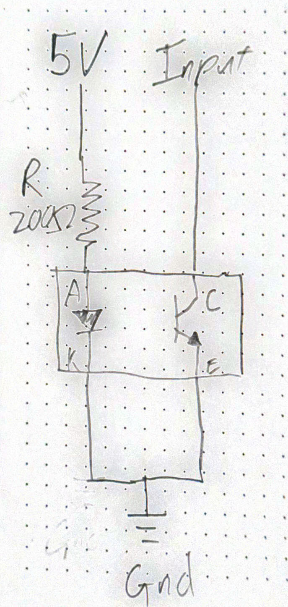
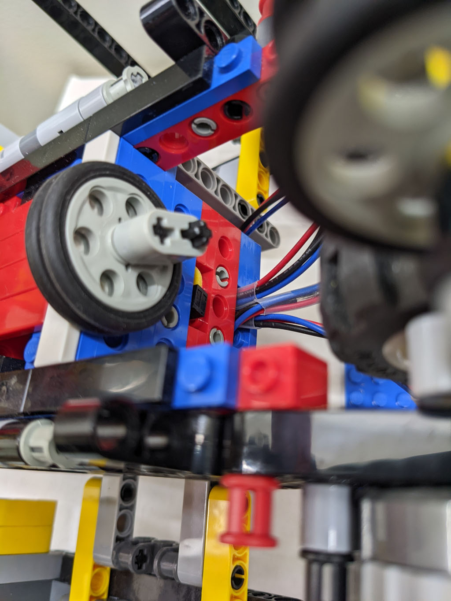
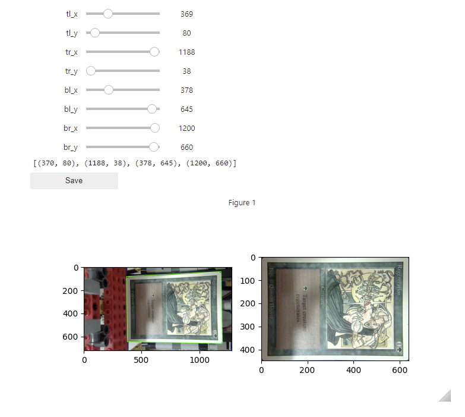

# Open Sorts (open_sorts)
Sorting machine for TCGs such as Magic: The Gathering

Copyright 2022 Kennet Belenky.

## Overview

The Open Sorts sorting machine is designed to sort and potentially catalog cards for Magic: The Gathering.

It is constructed from Lego pieces and easily obtainable non-Lego components.

As of 3/13/2022, its sole functionality is sorting cards. There is, however, a clear path to a variety of other functions:

*   Cataloging cards to a CSV.
*   Documenting cards, possibly for resale or insurance purposes, saving images in the process.
*   Filtering cards by price, color, set, or some other critera.

It is my hope that with community contributions, the project can grow to have improved, expanded, and novel capabilities.

# Notices

### Safety

This machine uses electrical components including motors. It carries risks for fire, electrical shock, mechanical harm or other malfunctions.

*   Build and operate this machine at your own risk.
*   Never leave the machine unattended while plugged in.
*   Make sure the machine is unplugged and fully powered off before touching any electrical components.

### Damage to cards

This machine is designed to be used with collectible trading cards. Due to physical constraints, cards must be unsleeved when processed by the machine. Any time a trading card is touched, there is a risk that the card will be damaged or destroyed. Processing a card with a machine carries even more risks and modes of failure.

*   Use this machine on cards at your own risk.
*   No guarantee is made that the machine will not damage or destroy cards.

### Might not even work

Even with instructions, building and operating this machine is no small task.

No guarantee is made that this machine will even work for you. Lego pieces and the associated electrical components are not cheap. Make sure that you're ok with the possibility of failure.

### License

Open Sorts is free software, and instructions: you can redistribute it and/or modify it under the terms of the GNU General Public License as published by the Free Software Foundation, either version 3 of the License, or (at your option) any later version.

Open Sorts is distributed in the hope that it will be useful, but WITHOUT ANY WARRANTY; without even the implied warranty of MERCHANTABILITY or FITNESS FOR A PARTICULAR PURPOSE. See the GNU General Public License for more details.

You should have received a copy of the GNU General Public License along with Foobar. If not, see <https://www.gnu.org/licenses/>.

### Acknowledgements

This work would not have been possible without the data and images provided by Scryfall.

# Required Skills

To build this machine and get it working, you'll need the following skills:

*   Familiarity with a Windows or Linix command line interface (Bash or cmd, or similar)
*   Using, writing and/or understanding a very simple batch file or shell script
*   Using PIP to install Python packages.
*   Editing a JSON file
*   Changing a few constants in both Python and C++ code.
*   Assembling a Lego design from a BrickLink Studio .io file. As of 3/2022, I have not yet organized the model into instructions.
*   Basic soldering skills
*   Ability to puzzle things out a bit and figure out why a mechanical thing isn't working.
*   Ability to use the arduino-cli (https://www.arduino.cc/pro/cli). This includes figuring out what serial port to use, what toolchain you need for your board, and how to install libraries.

# Parts

Make sure you read this entire section carefully. If parts are unavailble,  you may need to make some alterations in order to accomodate the changes.

All links provided are just a reference of what I'm talking about. I am not endorsing any specific retailer.

Some retailers you may wish to look at for parts, not in any particular order are:

*   www.adafruit.com
*   www.sparkfun.com
*   www.digikey.com
*   www.mouser.com
*   www.jameco.com

## Lego


All of the Lego pieces should be documented in the file: `/bricklink/parts_list.csv`.

This should be uploadable to http://bricklink.com and split into the necessary purchases. For nearly all the pieces, the color does not matter. Buy whatever color is cheapest.

The exception with regard to color is the smooth "tile" pieces that line the scanning tray. They should be light gray. It's not critical that they're light gray. It'll generally work just fine with other colors, but it does reduce the error rate.

### Power Functions motors

The instructions call for Lego Power Functions XL motors. Unfortunately, Lego has retired the Power Functions line of motors. Even on Bricklink, the motors tend to be quite expensive.

The situation is further complicated by the fact that it appears that at least one operation is selling counterfeits on eBay. I have a suspicion that many of Power Functions motor for sale on Bricklink are actually counterfeits that sellers are trying to pass off as genuine.

This project would benefit greatly if an enterprising individual came up with a more easily sourced component to use.

In addition to the Power Functions motors, this project requires:

*   **1x** 8" Lego Power Functions Extension Wire https://www.lego.com/en-us/product/lego-power-functions-extension-wire-8886
*   **1x** 20" Lego Power Functions Extension Wire https://www.lego.com/en-us/product/lego-power-functions-extension-wire-20-8871

### Nuts and Bolts

The drag arm of the secondary hopper requires two threaded bolts in order to set its height precisely.

I built my project using the rare and expensive Lego threaded axle (3705b) and Technic axle nut (4698). They worked for me because I happened to have them on hand.

I believe that a 2" long, #10 bolt and nuts (no washers) would likely make a more suitable alternative.

For example: https://www.homedepot.com/p/Crown-Bolt-10-24-x-2-1-2-in-Internal-Hex-Socket-Cap-Head-Cap-Screws-2-Pack-21158/203575413

Some experimentation may be necessary, and it is possible that a #8 is more suitable instead.

*   **2x** 2" long, #10 bolt
*   **6x** Hex nuts

### Rubber bands

The drag arm for the primary hopper requires rubber bands that are substantially lower profile than the Technic Wedge Belt Tire (2815). I used rubber bands from a grocery store pack of rubber bands.

*   **1x** Pack of rubber bands from the grocery store with at least **6x** rubber bands suitable to fit on a Technic Wedge Belt Wheel (4185)

## Camera

### Logitech C270

I used a Logitech C270 external webcam. The Lego model includes a structure that can securely mount the C270. Logitech also makes other cameras with the same form factor. It is _probable_ that they can be mounted with the same frame.

Aside from the physical form, any webcam with 640x480 resolution or better is suitable.

If you use a different webcam, you'll need to design your own mount for it. Please share your designs if you do.

### Close Focus Lens

Webcams normally can't focus as closely as we need for this machine. For this project we need approximately 6 diopters of close focus adjustment.

I used a 55mm Tiffen close focus lens kit, but it looks like the Vivitar version is cheaper:
https://www.bhphotovideo.com/c/product/1278181-REG/vivitar_viv_cl_55_55mm_close_up_filter.html

It comes with a +4 and a +2 that can be stacked. The Lego design includes a frame that will hold the 55mm lenses securely in front of the webcam.

Image quality is not a major concern with this project, so the cheaper lenses will almost certainly work just fine.

It is likely that there are even cheaper alternatives out there (like the lenses that were used for Google Cardboard). If anyone finds a cheaper alternative, please share.

*   **1x** Logitech C270 or other suitable camera
*   **1x** Close focus lens kit

## Electronics

### The Arduino Board

I used an Arduino Mega ADK because it's what I had on hand. However, there's nothing special about it that's needed for this project: https://docs.arduino.cc/retired/boards/arduino-mega-adk-rev3

I haven't personally used it, but I believe the Arduino Uno R3 should be sufficient:
https://docs.arduino.cc/hardware/uno-rev3

### Power supply

The motors operate at higher voltage and draw more current than the USB cable can provide. You need a separate power supply.

I used a the power brick from an old Netgear router that provides 2.5A at 12V.

If you choose to just directly buy a supply, this seems to fit the bill:
https://www.adafruit.com/product/352

It is probable that you can use a 9V power supply. However, it's likely that you'll need to turn up the selected motor speeds in the `.ino` file for the Arduino.

Note: I used a 12V power supply. The Adafruit motor shield passes the current through at the voltage provided (i.e. 12V). The Lego Power Functions motors are 9V motors. Driving DC motors with higher voltages than their rating can lead to premature motor failure or even fires. However, I have not personally had an issue yet.

### Motor Shield

I used the Adafruit Motor Shield v2.3

https://www.adafruit.com/product/1438

It's likely that other motor drivers would work, but would require adjusting the Arduino code to match.

### Sensors

The device uses 5 separate optical proximity sensors.

I used OPB706A because I had them on hand:
https://www.digikey.com/en/products/detail/tt-electronics-optek-technology/OPB706A/498716

However, they're quite old and I suspect they're not manufactured anymore.

It looks like the QRD1114 is a suitable replacement:

https://www.sparkfun.com/products/246

### Resistors

The QRD111 needs to be paired with a current limiting resistor. I recommend 150 Ohm, but really anything between 100 and 200 Ohms should work.

### Connecting the sensors

Each sensor requires its own 5V and ground connection in addition to the signal wire. It's best if you break out the 5V and ground separately for each sensor.

You have two options here.

Option 1 (not the option I took), use a prefabricated Arduino sensor shield and female headers:

*   **1x** Arduino sensor shield: https://vetco.net/products/arduino-uno-sensor-servo-shield-d7
*   **5x** 3-pin female header (I usually buy long pieces of female header and cut to the number of pins I need. Keep in mind, one pin will be destroyed in the cutting process): https://vetco.net/products/40-pin-female-single-row-header-connector-pc-mount-0-1-quot/vupn7421

Option 2 (What I did, because I had the stuff on hand):

*   **1x** Breadboard: https://www.adafruit.com/product/64
*   **5x** 5-pin male header: You can get one 40 pin piece and cut it into 5-pin lengths and still have some left over: https://www.sparkfun.com/products/116
*   **1 pack** Jumper Wires: https://www.adafruit.com/product/1957

### Standard electrical stuff:

*   **3 spools** 22AWG wire: black, red, some other color https://www.sparkfun.com/products/8867
*   **Heat shrink**, for example, but not limited to: https://www.sparkfun.com/products/9353
*   **electrical tape**
*   **solder**
*   **soldering iron**
*   **wire clippers & stripper**

# Assembly

## Download the github repository

All the code and documentation you need _should_ be available in the git repository here:

https://github.com/kbelenky/open_sorts

## Basic Configuration

There are two computer-specific things you need to update in `config.json`

*   `camera_id`: If your computer has no other webcam, this _should_ be 0. However, most laptops have a built-in webcam and you'll need to tinker a little bit to figure out which webcam is the one for the card recognizer.
*   `serial_port`: This is the serial port that the computer uses to talk to the Arduino. It will vary for every computer. There's a decent tutorial of how to find your Arduino's serial port here: https://www.mathworks.com/help/supportpkg/arduinoio/ug/find-arduino-port-on-windows-mac-and-linux.html

Additionally, when using the Arduino CLI (or Arduino IDE), you'll need to specify the correct serial port.

## Set up the Arduino software.

I used the [Arduino CLI](https://www.arduino.cc/pro/cli). Downloads are [available here](https://github.com/arduino/arduino-cli/releases).

You can also use the Arduino IDE. It'll work either way.

You'll need to install the following libraries:

```
"Adafruit Motor Shield V2 Library"
AccelStepper
ArduinoJson
```

Note: I'm not actually sure you need the AccelStepper library, but I have it in my notes that I installed it.

Once the Arduino software is set up, load up the sketch `card_sorter.ino`, compile it and download it to your board.

## Hooking up the motors

Before we do anything else, let's get the Arduino, motor shield and motors hooked up.

Adafruit provides a good tutorial on how to get started with the motor shield:

https://learn.adafruit.com/adafruit-motor-shield-v2-for-arduino

There's a good tutorial, with pictures, on how to dissect a power functions extension into two motor hookups.

https://scuttlebots.com/2014/03/02/lego-pf-hacking-wiring/

A couple of important notes:

*   The machine uses 3 motors, so we need 3 motor hookups. You'll have one left over.
*   Cut the 8" extension cable in half to create 2x 4" motor hookups.
*   Cut the 20" extension cable into a 16" hookup and a 4" hookup. One of the 4" hookups will not be used.
*   The wire inside the power function cords is a metal that does not take solder well (aluminum?). I don't have any advice, just be forewarned.

Once the hookups have been made like in the scuttlebots tutorial, hook them up into the M3, M4 and M1 ports in the Adafruit motor shield.

The motor shield has two, 5-terminal mounting blocks. Each mounting block can power two DC motors using terminals 1, 2, 4, 5. The center terminal 3 is a ground connection that we don't use.

| 1          | 2          | Ground | 4          | 5          |
|------------|------------|--------|------------|------------|
| Motor 1 C1 | Motor 1 C2 | Unused | Motor 2 C1 | Motor 2 C2 |

Once the wires are securely fastened to the terminals, connect the Lego plug ends to the Power Functions Motors and follow the instructions "Using DC Motors" in the Adafruit tutorial to make sure all 3 motors work.

## Hooking up the sensors

The machine uses 5 contactless IR proximity sensors.

*   One to tell if the primary hopper has any cards in it.
*   One to tell if the secondary hopper has any cards in it.
*   Two to tell if the tray has any cards in it. We need two because as the card moves into a basket, it will uncover the a sensor before it has fully left the tray.
*   One to detect when the sorting wheel has returned to the neutral position.

The sensors consist of two components: an infrared (IR) LED and a phototransistor that is sensitive to IR, both facing in the same direction. When an object is near, the phototransistor detects the reflected IR, and becomes conductive.

We need to wire up the LED with a current limiting resistor (150 Ohm), from the Arduino's 5V pin to ground.

The phototransistor will be wired from one of the Arduino's analog input pins through the phototransistor, to ground. No pull-up resistor is required because the Arduino allows you to enable a built-in pull-up resistor in software.

Sparkfun provides a mostly good tutorial on how to hook up these sensors:

https://learn.sparkfun.com/tutorials/qrd1114-optical-detector-hookup-guide

IMPORTANT NOTE: Sparkfun's tutorial shows a 10K pull-up resistor from the Arduino's 5V to the collector of the phototransistor. This is not necessary because we use the software-enabled pull-up resistors. There should be no connection of any sort from 5V to the collector.



If you chose to use the Arduino Sensor Shield, the instructions will diverge here. You'll do something very similar, but you'll be hooking up the wires to female header instead of male header.

**Instructions for wiring the sensors with a breadboard**

_Side note: I am a total hack at wiring things up. My techniques are probably not to be emulated, but they did work for me._

_Disclaimer: In the pictures below, eagle-eyed readers will see that I have my 5V and ground wires reversed from these instructions. It's fine, because I'm consistent, but it was poor technique. I recommend you do as I say, not as I do._


_Wired up sensor_


_Male header for sensor_

_Step 1:_ Cut a 5-pin piece of male header.

_Step 2:_ Using a pair of pliers, pluck out pins 3 & 4. They should slide right out of the plastic. This will leave a gap in the pins. Let's number the pins 1 (ground), 2 (5V), 3 (missing), 4 (missing), 5 (signal).

Look at the sensor with the pins facing away from you. You'll see a tiny little dot on one corner (it's shown in the illustration on the Sparkfun tutorial: https://learn.sparkfun.com/tutorials/qrd1114-optical-detector-hookup-guide). Orient the sensor so the dot is in the top-left corner.

The pins on the sensor will correspond to:

| 2 (5V) dot | 5 (signal) |
|------------|------------|
| 1 (ground) | 1 (ground) |

_Step 3:_ Solder 2 black wires together to the ground pin. We use 2 wires because one goes to the diode, and the other goes to the phototransistor.

_Step 4:_ Solder a red wire to the 5V pin. Solder the 200 ohm resistor in-line with the red wire.

_Step 5:_ Solder a colored (I used blue) wire to the signal pin.

Use heatshrink tubing or electrical tape as needed to ensure there are no shorts between wires.

_Trick: Sometimes soldering to pins of male header will melt the plastic a little bit and loosen the pins. When this happens, you can use a drop of 5-minute epoxy on the pins to ensure they stay in place. However, I recommend you make sure the sensor works before you add epoxy._

_Step 6:_ plug the male-header into the breadboard as shown in the picture. The 5V and ground pins should be in the + and - rails on the edge of the breadboard. The gap for the missing pin will span over towards the center portion of the breadboard.

_Note: On the breadboard, the sockets on the rails aren't perfectly in the same grid as the sockets in the middle section of the board. Your male-header plug will be a little crooked, and that's fine._

_Step 7:_ Run jumper wires from the 5V pin of the Arduino to the + rail of the breadboard, and from the ground pin of the Arduino to the - rail of the Arduino.

_Step 8:_ Test the LEDs. Plug in the arduino using just the USB cable. We aren't running a program on it  yet, we just want to power up the LEDs. You can't see the IR LEDs with your eyes, but most digital cameras can. Use your cellphone camera or a webcam to look at the sensor head-on. You should see a bright purple dot when it's powered on.


_Sensor wired up to pin 7 of the Arduino_

_Step 9:_ Run a jumper from digital input pin 7 on the Arduino to a pin in the same column of the breadboard as the male header (see picture). Run the program `sensor_test.bat`. You should see the result change as the sensor is covered and uncovered.

Repeat steps 1-9 four more times so that you have 5 sensors in total.

## Lego

Load up `sorting_machine.io` in BrickLink Studio and assemble the machine.

Note, I have not currently organized the model into step-by-step instructions, so you'll have to puzzle it out a little bit.

Once the machine is assembled, but before you attach the motors, make sure that all 3 moving axles rotate freely with minimal friction. The axle for the tray can be especially tricky to ensure that they don't catch or bind on anything as they rotate.

### Put rubber bands on the primary hopper drag arm

The v-groove pulleys on the primary hopper drag arm need to have rubber bands on them.


### Attaching the Sensors

Four (4) of the sensors are held in place using part 85943 and a 2-stud long axle:

https://www.bricklink.com/v2/catalog/catalogitem.page?P=85943

I found that wrapping the sensor with a small piece of thin foam helped cradle them even better.


These four sensors will be located in the Primary Hopper, Secondary Hopper, and 2x in the Sorting Tray.

The fifth sensor is mounted horizontally below the sorting tray. It detects when the wheel returns to the neutral, fully retracted position.


_Return sensor as seen from the side, with cable routing below._

Note: I used a slightly different sensor mounting for the tray sensors, so don't get thrown off by the small screws that you can see.



_Return sensor with wheel in the up position_


_Return sensor with wheel in the down position_

### Mounting the close-focus lens

The camera requires +6 diopters of focus correction. The lens kit should have a +2 and +4 lenses. Screw them together. The +2 lens should be on back. Otherwise the bulging +4 will scrape the back of the +2.

There is a space where the lenses are held firmly in place:


_Close focus lens mounted in its position. Note how it's being held down by the 2-long thin liftarms_.

### Mounting the camera

There is a green light on the front of the camera that turns on when the camera is active. The light will reflect back off of the close-focus lens. Use a small piece of electrical tape to cover the light.

Mount the camera as shown in the picture:


_Camera mounted in its bracket. Note how the drak gray axles fit into the groove between the camera's body and clip. The light gray bushings stabilize the camera side-to-side._

### Setting up the secondary drag arm.

Note: These instructions are different from what I did (see the note about "Nuts and Bolts" above), but they _should_ work. The pictures will look different, but the idea is the same.

The drag arm on the secondary hopper has to be firmly set to just the right height (there's some room for error, but not a ton).

The wheels, which don't turn, have to be a little more than a card-thickness above the motorized drive-wheels of the secondary hopper. This creates a gap that cards can only pass through one at a time.

On each side, run a bolt from the eye-post of the upright liftarm to the eye-post on the drag-arm. Each bolt should have 3 nuts on it, so that the sequence is: head-of-bolt, eye-post, nut, gap, nut, eye-post, nut.

Adjust the nuts so that there is a narrow gap between the drag wheels and the motorized wheels.

Once you get it right, counter-rotate the nuts against each other to squeeze the eye-posts and lock things in place.


_Secondary drag arm set to correct height. Note how there is a small gap between the upper, immobilized wheels, and the lower drive wheels. The Lego threaded axle and nuts that adjust the height are in the upper-right of the image. This is where you'll use a bolt instead of the rare Lego pieces._


### Hook up the Arduino

Hook up the sensors to the breadboard or sensor shield. Each sensor needs a different digital pin. I used:

| Sensor           | Pin |
|------------------|-----|
| Primary Hopper   |   7 |
| Secondary Hopper |   6 |
| Tray Sensor 1    |   5 |
| Tray Sensor 2    |   4 |
| Return Sensor    |   3 |

But you are welcome to use other schemes, so long as they work. The file `config.json` contains the mapping of sensors to pins.

Connect the motors to the motor hookups that are installed in the motor shield. I used:

| Motor            | Number |
|------------------|--------|
| Primary Hopper   |      1 |
| Secondary Hopper |      4 |
| Tray             |      3 |

Again, you can use whatever mapping you want, so long as you adjust `config.json` to match.

Place the Arduino and Breadboard in their spots at the bottom of the machine.

At this point, the machine should be physically set up and should look like this:

_Note: There are some differences between my build and the one in the design. Most notably, I used an L Motor and gearing instead of an XL Motor for the tray. On the whole, the design in the BrickLink file should be as good or better than the one I built._


It just needs one final touch.

I have found that my overhead lights reflect off the back surface of the close-focus lens and back into the camera, creating smears of glare. A cardboard deckbox provides a a simple solution to this:


# Getting the software set up

## Ensure the sensors are working correctly.

1.  Connect the Arduino to your computer with the USB cable (external power is optional for this one since we won't be running the  motors).
1.  Run `sensor_test.py`. This will produce a running output of the current sensor states. One by one, place a card in the primary hopper, secondary hopper, and tray, and ensure that the sensor values change from `empty` to `triggered` and back again.
1.  Things to look for: Are your sensor mappings correct, or do you have the sensors hooked up to the wrong pins? Does the card trigger the sensor (does it flip from `empty` to `triggered` when you place a card over it)?

## Test and calibrate the motor directions.

1.  Connect the Arduino to your computer with the USB cable and attach the external power cable to the Arduino's barrel jack.
1.  Run `motor_test.py`
1.  Follow the instructions.
1.  Things to look for: Do the correct motors run at the correct time? Is the motor turning in the right direction?
1.  Adjust the values in `config.json` as needed. The `motor` keys let you select the motor output on the motor shield (values can be 1-4). The `direction` keys select the direction for each motor (values 0-1). If a motor runs in the wrong direction, flip the value.

## Loading the hopper

1.  Remove the Hopper Weight if it is in the hopper.
1.  Place a stack of cards face-up in the hopper, with the card backs facing down. The recognizer should work with the cards in either orientation so long as the face is up (for DFCs, the recognizer will recognize the back face, and sort the card according to the properties of the back face).
1.  Place the Hopper Weight on top of the stack of cards with the smooth side down.
1.  Lift the primary hopper arm, just for a moment, so that the cards can settle onto the drive wheel.

<a href="images/hopper_reload.mp4></a>

When reloading the hopper from the sorting baskets, always put the contents of the left basket into the hopper first, followed by the right basket. This is a critical step in the sorting process.

## Test the card feeding operations.

1.  Load a stack of cards (ones you don't mind getting damaged if it comes to it) into the primary hopper.
1.  Place the hopper weight on top of the cards, smooth-side facing down.
1.  Lift the drag arm of the primary hopper briefly to allow the cards to settle into place 
1.  Run `command_test.py`
1.  One or more cards should automatically feed from the primary hopper into the secondary hopper.
1.  Use the controls to feed cards into the sorting tray and then send them right and left.
1.  Things to look for:
    1.  Do the cards feed at all?
    1.  Does the secondary hopper feed cards one at a time? If it feeds more than one, then the secondary drag arm needs to be lowered a little, by adjusting the nuts.
    1.  Do the cards feed smoothly out of the secondary hopper? If they seem to stall out, then the secondary drag arm is too low and needs to be lifted a little.
    1.  Do the cards drop cleanly when sent from the sorting tray into the baskets?
    1.  Do the wheels of the sorting tray fully retract when not in use? If not, then the return motor is not set up right.
    1.  If the sorting tray wheel regularly takes more than one revolution to send a card into a basket, it is set too fast. Reduce its speed in `config.json`.
1.  Things that are not a problem.
    1.  If the primary hopper feeds more than one card at a time into the secondary hopper. Don't worry about it. It's the secondary hopper's job to ensure that only one card at a time is fed.
    1.  If you tell it to feed the next card and there's already a card in the tray, nothing will happen.
    1.  The secondary hopper motor runs in reverse for a moment after a card is fed to the tray. This is normal.

## Test that the camera works at all

Put a test card centered on the sorting tray.

Go to: https://www.onlinemictest.com/webcam-test/ to view your webcam.

1.  Make sure it's reasonably in focus.
1.  Make sure there's no glare.
1.  Make sure the card is fully in view of the camera. It doesn't have to be straight and centered (we'll take care of that next). It just has to be fully in view.
1.  Make sure there's no extreme shadows. The card recognizer is fairly tolerant of uneven lighting, but it's best to set it up for success.

## Calibrate the camera's perspective

Note: If your computer has more than one webcam (common with laptops that have built in webcams) you'll need to specify which webcam using the `camera_id` parameter in `config.json`.

Note: The camera mount is flexibly hinged in its connection to the machine. Every time you move the machine, the camera's perspective changes, and you will need to repeat the perspective calibration process.

Put a test card centered as best you can on the sorting tray.

From the command line, run `jupyter-lab align_camera.ipynb`.

Click the play button on the notebook.

At the very bottom, you'll see two images side by side. One image shows what the camera sees, with a blue quadrilateral. The other image shows just the contents of the blue quadrilateral stretched and cropped into a card-shaped rectangle. Adjust the 8 sliders (top-left corner x&y, top-right corner x&y, etc...) until the the card (including black/white border) takes up exactly the cropped image.

It should look like this.



Click the "Save" button to save the keypoints to the `config.json` file.

## Test the recognizer

Run `recognizer.py`.

This program shows the name of the card that's on the tray.

Try a variety of cards on the tray and make sure it produces reasonable answers. Mis-recognizing the set is common, but it should pretty much always get the name right.

Don't worry about garbage results from when your hand is in view or the card is in motion. The recognizer takes its best guess even when what it's viewing is literally not a card.

If the recognizer doesn't produce reasonable results, it's most likely either that your lighting is bad or your perspective is misconfigured from the previous step.

## Test the sorting

At this point, everything _should_ be set up and ready to go.

Run `sorter.py` from the command line and follow the instructions.

Start with a small test batch (5-10 cards) to make sure it's reasonable.

# Celebrate

If you've made it this far, please share your experience at https://reddit.com/r/open_sorts

# Future roadmap

Here's a list of ideas, in no particular order, that would be great improvements:

*   Auto-align the camera on every card. The cards never land in exactly the right place. The recognizer is robust to movement, but it works better when the cards are well registered. Detect the corner keypoints for the perspect transform on every card.
*   Rework the camera mount so that it's more rigid and doesn't shift when the machine is moved.
*   Figure out if anything can be done to reduce the latency of the camera.
*   Replace the Arduino + Computer combo with a Raspberry Pi Zero.
*   Replace the chassis with a cheaper material (possibly laser cut acrylic or something 3d printed).
*   Create a merge-sorting machine, that merges two hoppers full of sorted cards into a single output basket.
*   Create a taller version that supports more cards in the input and output baskets.
*   Improve the UI.
*   Improve the documentation.
