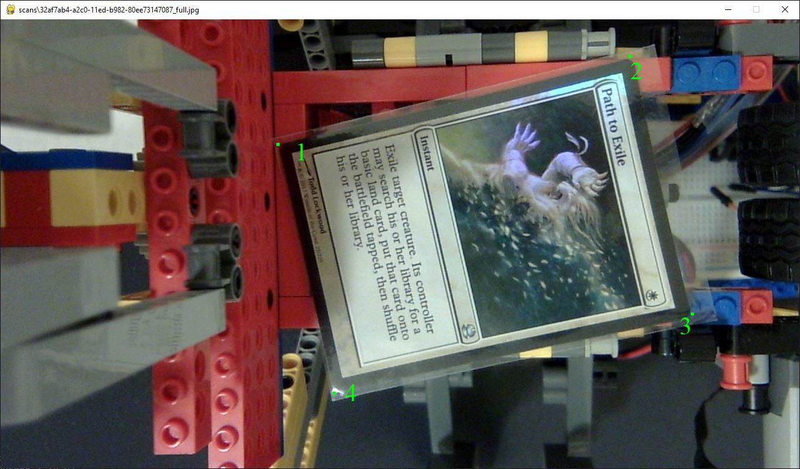

# How to train the Corner Detector

The corner detector takes a view that contains a card, and produces estimates of where the each of the four corners of the card is. These corners can then be fed into an inverse perspective transform to produce a decent, rectangular crop of the card.

## The basic flow works like this:

1.  Use `camera_mode.py` to take some sample images with cards at various positions in the camera's field of view.
2.  Use `corner_tagger.py` to provide ground-truth annotations of where the corners of the card are in each image that you captured in the first step.
3.  Use `build_corners_dataset.py` to assemble a TensorFlow dataset for efficient training.
4.  Use `train_corners_model.py` to train the model with the latest dataset.
5.  Use `camera_mode.py` to see how your latest model does. If you encounter any cards or positions the model doesn't do well on, capture them (step 1), and repeat.

## Use `camera_mode.py`

`camera_mode.py` does two things.

1.  It lets you observe the behavior of the corner detector and card recognizer.
2.  You can save images for training.

In order to run it, you have to have a webcam capable of 1280x720 resolution connected to the computer.

When you run it, you'll see the camera's view in the window, something like this:

Try it out with various cards at various angles. When you encounter a card or angle where the corners are inaccurately detected, press the `<SPACE>` bar to save an image in the `scans/` directory.

## Use `corner_tagger.py`

This tool allows you to do ground-truth annotation of where the corners should be.

The annotations are store din the `scans/` directory in .json files next to the saved .jpg images.

`corner_tagger.py` will go through each image that doesn't have an annotation, and let you annotate them.

Click on the four corners in on-screen order of: top-left, top-right, bottom-right, bottom-left. A green dot (but not a number, as shown) will appear with each click.

Note: The sequence of clicks is very important. The system will not function properly if you do it wrong.

Try to click where a sharp corner _would_ be if the card's corners weren't rounded.

Once you've tagged all four corners, press the `<SPACE>` bar to save the annotation.

If you messed up the clicks, press `<ESC>` to clear and start over.

Corner tagging is tedious, but it doesn't take that long and you only need one or two hundred good examples to train an effective model.

## Use `build_corners_dataset.py`

The training process works best with a TensorFlow-friendly streaming dataset, rather than a bunch of disjoint files.

`build_corners_dataset.py` takes all the image and annotation files, resizes the images, parses the JSON and bundles it all together.

Important: Before you run `build_corners_dataset.py`, delete the existing files in the `datasets/` directory. Otherwise it will append.

Simply run `build_corners_dataset.py`. That's all

## Use `train_corners_model.py`

It will train a corner detection model from the dataset. Not much more to it than that.

As one side note, the `corners.tflite` model that is distributed with the repo has two quirks:

1.  It is trained using some image augmentations that I am not currently willing to open-source. It would require a larger, more diverse dataset to get the same level of performance and generalization.
2.  The training images are fairly homogenous, because they were all shot on my sorting machine. This hurts generalization. Since your camera and context will be different, it is likely that it will not perform as well for you as it does for me (without retraining).

## Use `camera_mode.py` to see how your trained model does.

Basically go back to step 1 until you're happy with the results.

